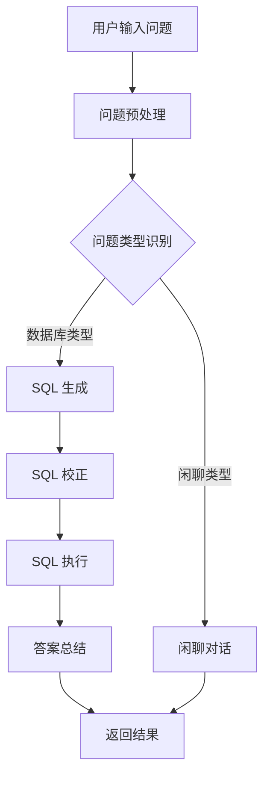
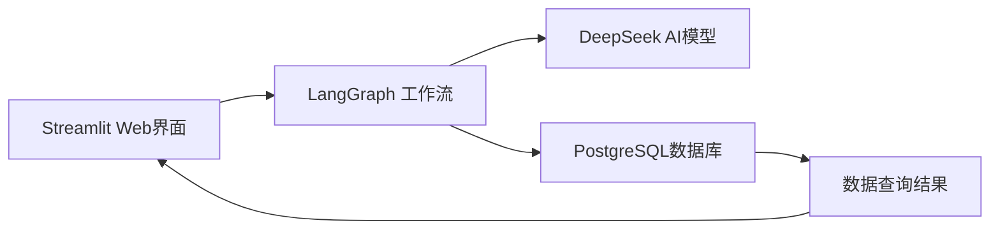

# 🤖 问数机器人 - 项目介绍

## 📋 项目概述

问数机器人是一个基于 **LangGraph** 和 **Streamlit** 构建的智能问答系统，能够将自然语言转换为 SQL 查询并执行数据库操作。系统支持两种模式：**闲聊对话** 和 **数据库查询**，通过智能路由自动识别用户意图并选择合适的处理方式。

## ✨ 核心特性

### 🎯 智能问答
- **自然语言转 SQL**: 将用户的自然语言问题自动生成 SQL 查询语句
- **智能问题路由**: 自动识别是闲聊问题还是数据库查询问题
- **多模态回答**: 支持文本对话、数据查询结果展示等多种回答形式

### 🔄 LangGraph 工作流
- **问题预处理**: 对用户输入进行预处理和格式化
- **SQL 生成**: 基于数据库表结构生成准确的 SQL 语句
- **SQL 校正**: 对生成的 SQL 进行语法和逻辑校正
- **SQL 执行**: 连接数据库执行查询并获取结果
- **答案总结**: 将查询结果整合为自然语言回答

### 🌐 Web 界面
- **现代化 UI**: 基于 Streamlit 构建的响应式用户界面
- **实时状态监控**: 侧边栏显示系统各组件状态
- **示例问题**: 内置快捷示例问题，一键体验
- **结果可视化**: 查询结果以表格形式展示

## 🏗️ 技术架构

### 后端技术栈
```
├── LangGraph        # 工作流编排框架
├── LangChain        # LLM 应用框架
├── SQLAlchemy       # 数据库 ORM
├── PostgreSQL       # 主数据库
├── DeepSeek API     # AI 模型服务
└── Python 3.11+     # 编程语言
```

### 前端技术栈
```
├── Streamlit        # Web 应用框架
```


## 🔄 工作流程

### 数据库查询流程


### 系统组件交互

## 🚀 快速开始

### 1. 环境准备
```bash
# 克隆项目
git clone https://github.com/heibaibufen/text2sql-hiring.git
cd text2sql-hiring

# 安装依赖
uv sync
```

### 2. 环境配置
```bash
# 复制环境配置文件
cp .env.example .env

# 编辑配置文件
nano .env
```

配置内容：
```bash
# 数据库连接
POSTGRES_HOST=localhost
POSTGRES_PORT=5432
POSTGRES_DB=winwin
POSTGRES_USER=winwin
POSTGRES_PASSWORD=winwin1234

# AI 模型配置
OPENAI_API_KEY=your_api_key
OPENAI_BASE_URL=https://api.deepseek.com/v1
```

### 3. 启动数据库
```bash
# 使用 Docker 启动数据库
cd docker
docker-compose up -d
```

### 4. 启动 Web 应用
```bash
# 方法1: 使用启动脚本
python run_streamlit.py

# 方法2: 直接启动
streamlit run web_app.py
```

访问 http://localhost:8501 开始使用！

## 💡 使用示例

### 闲聊对话示例
```
用户：什么是LangGraph？
回答：LangGraph 是一个基于 LangChain 的状态图框架，用于构建复杂的AI应用工作流...

用户：你今天心情怎么样？
回答：作为AI助手，我没有真正的情感，但很高兴能为您提供帮助！
```

### 数据库查询示例
```
用户：2024年即饮茶的总销售额是多少？
系统：生成 SQL -> 执行查询 -> 返回结果
回答：2024年即饮茶的总销售额为 1,234,567 元。

用户：查询销量最高的10个商品
系统：生成 SQL -> 执行查询 -> 展示表格
回答：以下是销量最高的10个商品：
[商品名称, 销售额]
[可口可乐, 567,890]
[百事可乐, 456,789]
...
```

## 🛠️ 核心功能模块

### 1. 智能路由器 (Question_Router)
- 功能：识别用户问题类型
- 输入：自然语言问题
- 输出：问题类型（数据库类型/闲聊类型）

### 2. SQL 生成器 (SQL_Generator)
- 功能：根据问题和数据库结构生成 SQL
- 特点：支持复杂查询、聚合函数、多表连接

### 3. SQL 校正器 (SQL_Correction)
- 功能：校正 SQL 语法和逻辑错误
- 工具：使用正则表达式和规则引擎

### 4. SQL 执行器 (SQL_Executor)
- 功能：连接数据库执行 SQL
- 特点：事务安全、错误处理

### 5. 答案总结器 (Answer_Summary)
- 功能：将查询结果转换为自然语言回答
- 特点：智能总结、结果格式化

## 🔧 高级配置

### 自定义提示词模板
项目支持自定义各种提示词模板：
- 问题路由模板
- SQL 生成模板
- 答案总结模板
- 闲聊对话模板

### AI 模型配置
支持多种 AI 模型：
- DeepSeek Chat
- OpenAI GPT 系列
- 其他兼容 OpenAI API 的模型

**🤖 问数机器人 - 让数据查询变得简单自然！**

## 项目思路
-1.技术选择：首先拿到这个项目，我的第一想法就是使用工作流的方式来处理走数据库节点还是走闲聊节点，然后我就使用了langgraph来构建工作流，
工作流结构上面已经展示过了。
-2.区分类型：对于如何区分问题到底是哪种类型的，我的方案是采用提示词工程，让大模型进行判断到底是哪种类型，然后使用提示词对大模型的输出进行约束，
让大模型只输出闲聊类型或者数据库类型。出于程序健壮性的考虑，如果不是这两种类型，那么会重新走一遍工作流，相当于重新判断一次。
-3.sql语句生成：对于如何生成sql语句，最终还是使用的提示词工程，使用langchain的提示词模版，将sql案例，问题，数据库schemas，约束写入提示词中，强制模型只生成跟
sql语句相关的内容。
-4.sql语句清洗：对于sql语句的矫正，我并没有加入，因为我觉得已经生成的很可以的，sql语句是没什么问题的，但是sql语句的格式不对，所以需要对生成的sql
语句进行清洗，将回答内容只包含sql语句。
-5.生成总结：对于查询到的数据，需要使用模型用自然语言进行一个总结，还是使用的提示词工程，对模型的输出进行约束，最终得到一个给用户的回答。
-6.整体数据流转：对于模型产生的数据，使用的是langgraph框架中的状态的概念，模型的每次运行都是对状态的改变，数据始终在状态中进行流转更改。
-7.安全性考虑：为了避免把敏感的数据库信息暴露给用户，设计了输入状态和输出状态，让用户只能看到输入和最终的输出，中间的状态不对用户进行开放，

## 项目后续可优化空间
-1.sql精准生成：为了更好的查询数据库，可以在生成sql的流程前面再次加一个模型，让这个模型根据问题生成所需要查询的数据，让后续sql语句的生成更加精准有效。
-2.闲聊模型的外置工具：因为闲聊模型不知道实时数据，可以使用langchain的tools，设置两个工具，一个是外部搜索工具，一个是时间显示工具。
-3.流程的健壮性：当一个流程因为模型出错而导致崩溃的时候，可以增加异常处理，当处于异常时，重新返回上一个节点进行生成。
